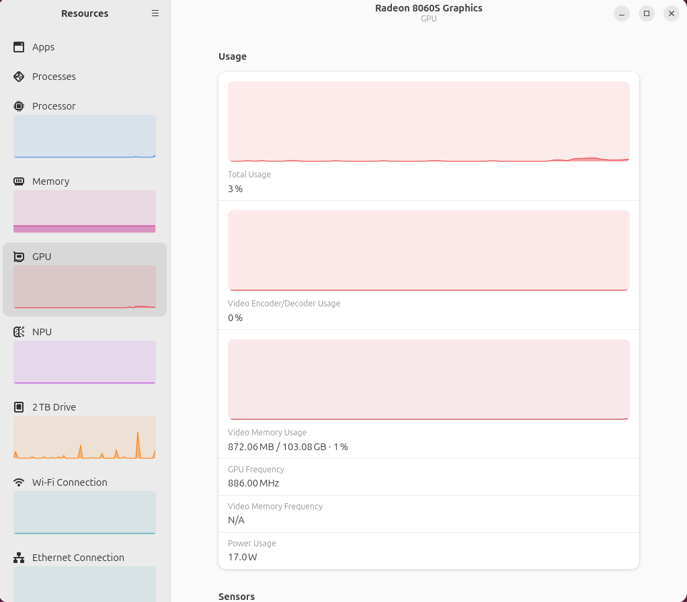

# strix-halo-uma-carveout

Read and set the dedicated-VRAM split (the UMA carveout) on AMD Strix Halo /
Ryzen AI Max systems **from Linux**, without AMD's Windows driver and without
AMD's own Linux distribution.

```
$ ./uma-carveout.py list
installed memory : ~126.6 GiB
acpi gpu path    : \_SB_.PCI0.GPPA.VGA_
sysfs            : /sys/class/drm/card1/device/uma/carveout

  idx  name        carveout        OS sees      preset
  ---  ----------  --------------  -----------  ------
    0  Minimum     512 MB           126.1 GiB  min
    1  -           1 GiB            125.6 GiB
    2  -           2 GiB            124.6 GiB
    3  -           4 GiB            122.6 GiB
    4  -           8 GiB            118.6 GiB
    5  -           16 GiB           110.6 GiB
    6  Medium      32 GiB            94.6 GiB  32
    7  High        64 GiB            62.6 GiB  64
  * 8  unlisted    96 GiB            30.6 GiB  96

  * = active

  index 8 is absent from carveout_options: it was set through ATCS, so only
  mem_info_vram_total attests to the size. The sysfs path cannot reselect it.
```

## Two things to know before you start

**Look in BIOS setup first.** HP's Strix Halo machines (Z2 Mini G1a, ZBook Ultra
G1a) put a VRAM dropdown in firmware setup. That path is supported, reversible
from the same screen, and needs no out-of-tree kernel module, no MOK enrollment
and no Secure Boot exception — so if it is there, use it and close this page.
Everything below exists for the machines where the setting is genuinely absent,
AMD's own RAH-001 reference platform among them. `--via atcs` in particular
writes an unvalidated value straight to an SMI handler; it is a last resort, not
a first one.

**A 96 GiB carveout reports as "103 GB".** `mem_info_vram_total` is in bytes, and
`103079215104` is exactly 96 × 1024³. Tools that divide by 1024³ say 96 GiB;
tools that divide by 1000³ say 103.08 GB. Both are the same carveout, and neither
is a sign that you got more memory than you asked for. Expect to meet this the
first time you compare a GUI monitor against a BIOS screen.

## The problem

On a 128 GB Ryzen AI Max+ 395 box, how much memory is dedicated to the iGPU is
the single most consequential setting for local AI work. On several of these
systems — including AMD's own **Ryzen AI Halo developer platform (RAH-001)** —
it is **not in BIOS setup at all**. AMD expects you to change it from software:

| OS | where the slider lives |
| --- | --- |
| Windows | AMD Software: Adrenalin Edition >= 26.5.1 -> Performance -> Tuning -> Variable Graphics Memory |
| Linux | AMD Ryzen AI Developer Center -> Settings -> Graphics Performance Settings |

The catch: that Linux app ships **only** inside AMD's own Debian-based distro,
*AMD Ryzen AI Developer Platform 1 "Rex"*. AMD documents it as "a permanent
component of the AMD Ryzen AI Halo's Linux software stack" that "cannot be
uninstalled" — there is no standalone `.deb`, no apt repo, and no published
Rex ISO. Install Ubuntu, Fedora or anything else and the setting becomes
unreachable, along with the BIOS updater that lives in the same app.

HP's Strix Halo machines (Z2 Mini G1a, ZBook Ultra G1a) *do* expose a BIOS
dropdown. AMD's reference box does not.

## What actually controls it

Not the OS. The carveout is written to firmware NVRAM and applied at POST, so a
change needs a reboot but survives OS reinstalls. There are two ways in.

### 1. sysfs — supported, limited

AMD upstreamed `drm/amdgpu: add UMA carveout tuning interfaces` (Dec 2025).
Where present it gives you:

```
/sys/class/drm/card*/device/uma/carveout_options   # read-only, firmware's list
/sys/class/drm/card*/device/uma/carveout           # read/write index, next boot
```

These files exist only on kernels new enough to carry the series **and** on
firmware that implements ATCS function `0x0A`. If `uma/` is missing, one of the
two is too old. Verified present on Ubuntu 26.04 / kernel 7.0.

It is **index-only by design** — you can select only sizes the Atom ROM
advertises. That is a driver policy, not a firmware limit.

### 2. ACPI ATCS function 0x0A — what the above calls underneath

The firmware method does no bounds checking whatsoever, and masks the index and
type to four bits each, so it can express sixteen of each. This is also the path
Adrenalin's "Custom" mode uses to reach sizes the preset list omits.
See **[docs/atcs-atca.md](docs/atcs-atca.md)** for the disassembled ASL.

## Install

```
git clone https://github.com/bytetroll/linux-amd-halo-carveout
cd linux-amd-halo-carveout
sudo apt install acpica-tools      # for `probe` only
sudo apt install acpi-call-dkms    # for `set --via atcs` only
```

No dependencies beyond the standard library. `list` needs no root.

## Usage

```
./uma-carveout.py list                    # firmware's options + the active one
sudo ./uma-carveout.py set 64             # by size: min, 32, 64, 96, or NN GiB
sudo ./uma-carveout.py set 32 --dry-run   # show what would change
sudo ./uma-carveout.py set --index 6      # by raw option index
sudo ./uma-carveout.py trace              # what index/type does the driver send?
sudo ./uma-carveout.py probe              # disassemble your firmware's ATCS
```

`set` writes the index, verifies the readback, and tells you to reboot. It
refuses sizes your firmware does not advertise rather than quietly poking ACPI.

`trace` kprobes `amdgpu_acpi_set_uma_allocation_size` and walks the advertised
indices through the supported sysfs path, recording the `index`/`type` pair the
driver sends for each, then restores your original setting. The firmware only
ever sees values it declared itself. Use it to read a known-good `type` byte out
of the driver instead of guessing one.

> **Why it uses bpftrace.** Ubuntu (and most distro kernels) ship with
> `CONFIG_KPROBE_EVENTS_ON_NOTRACE` unset, so writing to `kprobe_events` fails
> with a bare `EINVAL` — and *nothing* in `/sys/kernel/tracing/error_log`,
> because the refusal happens before the argument parser ever runs. It is not a
> syntax problem and no amount of fiddling with `$arg2` vs `%si` or the
> `module:symbol` prefix will fix it. BPF kprobes register through
> `create_local_trace_kprobe()`, which does not apply that check, so
> `--backend bpftrace` (the default when bpftrace is installed) just works.
> `--backend kprobe` forces the tracefs path if you want to see it fail.

## Known firmware option tables

| System | BIOS | RAM | Advertised carveouts |
| --- | --- | --- | --- |
| AMD Ryzen AI Halo (RAH-001) | 03.03 | 128 GB | 512 MB, 1, 2, 4, 8, 16, 32, 64 GiB |
| mainline kernel doc example | — | — | 10 entries, topping out at 32 GB |

**Please send yours.** Paste `./uma-carveout.py list` output plus your BIOS
version into an issue and it goes in the table. No firmware seen so far
advertises 96 GB — but it is reachable anyway; see below.

## 96 GB: confirmed working

AMD describes the RAH-001 as configurable to 96 GB dedicated (leaving 32 GB for
the OS), reached on Windows through Adrenalin's **Custom** Variable Graphics
Memory mode. On BIOS 03.03 the Atom ROM table stops at 64 GB, so the supported
Linux path cannot request it.

**Index 8 works anyway.** On the RAH-001, `trace` shows every advertised entry
going out as **type 2** with the ATCS index equal to the sysfs index, so index 8
packs as `0x28`:

```
sudo ./uma-carveout.py trace                                   # confirm T on your box
sudo ./uma-carveout.py set 96 --via atcs --index 8 --type 2
sudo reboot
```

Verified on 2026-09-29, AMD Ryzen AI Halo (RAH-001), BIOS 03.03, Ubuntu 26.04.1,
kernel 7.0.0-34:

```
$ cat /sys/class/drm/card1/device/uma/carveout
8
$ cat /sys/class/drm/card1/device/mem_info_vram_total
103079215104                       # 96 GiB exactly (96 * 1024**3)
```

The SMM handler accepts the unadvertised index and POST applies it.



*The carveout as a desktop monitor sees it — and the unit trap in the wild.
103.08 GB here is the same 96 GiB the kernel reports; GNOME Resources divides by
1000³. Nothing extra was gained: it is the 96 GiB AMD documents.*

Afterwards `carveout` reads back `8` while `carveout_options` still stops at 7,
so the sysfs path can no longer reselect the running size. `set 64` (or any
advertised index) still works normally and remains the way back.

If your firmware's handler rejects the index, the likely outcome is a fall back
to `UmaCarveOutIndexDefault` (0, i.e. 512 MB) rather than a failure to boot — a
visible change you can simply set back. **Please report either outcome.**

## Consider GTT before a big carveout

On Linux you often do not want a large carveout at all. `amdgpu` can lend the
GPU ordinary system RAM through the GTT, on demand, and hand it back — so a
small carveout plus a high GTT ceiling can give the GPU more addressable memory
than the largest carveout your firmware offers, while leaving idle pages to the
OS. This is the second slider in AMD's app, and it is pure kernel cmdline:

```
amdgpu.gttsize=<MB>  ttm.pages_limit=<MB * 256>
```

The default is auto, which is half of visible system RAM.
[`contrib/gtt-ceiling.sh`](contrib/gtt-ceiling.sh) sets both for you on GRUB
systems. Caveat: reported VRAM does not change, so tools that size allocations
off `mem_info_vram_total` may plan badly against a tiny carveout — verify with a
real workload rather than trusting the numbers.

## Secure Boot

`list`, `set` (sysfs), `trace` and `probe` all work with Secure Boot enabled.

`set --via atcs` does not, out of the box: it needs `acpi_call`, which is
out-of-tree, so `sig_enforce` rejects it until the DKMS signing key is enrolled.
`apt install acpi-call-dkms` builds and signs the module but does not enroll the
key, so `modprobe` fails with *Key was rejected by service*. Fix it once:

```
sudo mokutil --import /var/lib/shim-signed/mok/MOK.der
# pick a one-time password, reboot, then in the blue MOK Manager screen:
# Enroll MOK -> Continue -> Yes -> enter that password
```

Disabling Secure Boot in firmware setup works too, and additionally lifts kernel
lockdown. The script detects this situation and prints these steps rather than
just reporting a missing `/proc/acpi/call`.

## Risk and recovery

Changing an *advertised* carveout through sysfs is the supported path and is as
safe as the BIOS dropdown on an HP box.

The `--via atcs` path sends a value your firmware never advertised. The most
likely outcome for an unrecognised value is that nothing changes, because the
SMM handler ignores it — but that handler is not readable from the OS, so this
is an experiment, not a guarantee. If the machine will not POST afterwards,
clear CMOS: unplug and pull the coin cell. Both `UmaCarveOutDefault` and
`UmaCarveOutIndexDefault` exist as EFI variables, consistent with the firmware
keeping its own fallback.

No warranty; see [LICENSE](LICENSE).

## References

- [AMD Ryzen AI Halo User Guide](https://developer.amd.com/playbooks/user-guide/)
- [`drm/amdgpu: add UMA carveout tuning interfaces`](https://lwn.net/Articles/1046512/)
- [Misc AMDGPU driver information](https://docs.kernel.org/gpu/amdgpu/driver-misc.html) — merged sysfs docs
- [Phoronix: AMD's own Linux distribution built atop Debian](https://www.phoronix.com/review/ryzen-ai-linux-os)
